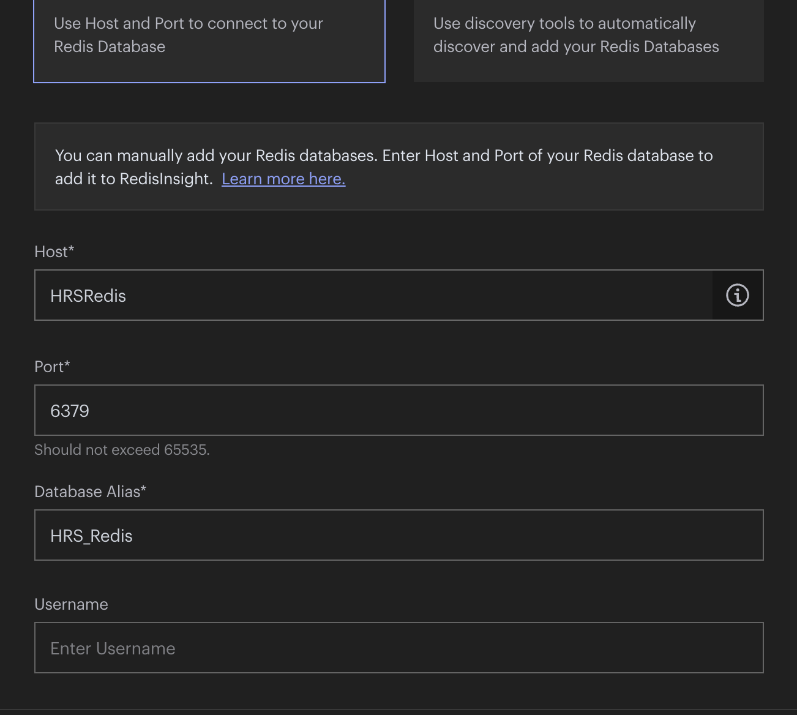

# Nexign Bootcamp Baby Billing project

___
___

##  <a>Введение</a>
В этом проекте я разработал: структуры базы данных CDR_DataBase, структуру базы данных CRM_DataBase,
подстроил под нужды проекта структуру базы данных BRT_DataBase, разработал архитектуру микросервисов,
разработал архитектуру микросервисного приложения, написал тесты, frontend и сами микросервисы, 
собрал все в docker-compose.yml, составил диаграммы.

___
___

## <a>Содержание</a>
Сначала я расскажу о том, как проект работает, какие решения были 
приняты, далее расскажу, как проект запускать и как взаимодействовать 
с frontend частью проекта, в конце представлю текст самого задания.
  Также прилагаю pdf файл со схемой данного микросервисного приложения,
его можно найти в папке 'info' в корне проекта под названием
BabyBillingStructure.pdf.
1. [Введение](#Введение)
2. [Содержание](#Содержание)
   1. [CDR_Service](#CDR_Service)
      1. [DateGenerator](#DateGenerator)
      2. [ConcurrentQueue](#ConcurrentQueue)
      3. [User](#User)
   2. [BRT_Service](#BRT_Service)
      1. [CallRecordsHandlerService](#CallRecordsHandlerService)
   3. [HRS_Service](#HRS_Service)
   4. [BRT_Service_part_2](#BRT_Service_part_2)
   5. [CRM_Service](#CRM_Service)
   6. [PostConstruct](#PostConstruct)
   7. [Frontend](#Frontend)
3. [Ссылки](#Ссылки)
4. [Запуск](#Запуск)
___
___

## <a>О проекте</a>
### <a>CDR_Service</a>
Начинает работать программа с сервиса CDR_Service, который по сути является
коммутатором, собирающим звонки пользователей. Реальных пользователей 
у нас нет, потому CDR_Service самостоятельно генерирует звонки, формирует из
них txt файлы и отправляет их в Apache Kafka.
  После запуска проходит 5 секунд, затем срабатывает метод initializer()
класса CDRService, в этом методе забирается информация о пользователях из 
CDR_DataBase (msisdnService.getMsisdns()), создается объект DateGenerator
и запускается как daemon thread (фоновый поток). ->
___
#### <a>DateGenerator</a>
Это класс, наследующий Thread, объект этого класса создается только один раз
и передается всем потокам, которые отвечают за эмулирование поведения пользователя.
Каждые две секунды объект DateGenerator сдвигает "каретку" даты на 1 день вперед, 
уведомляет об этом событии все потоки, говоря им, что "наступил новый день" и 
можно генерировать звонки на новое число, метод increaseDate() как раз отвечает за
сдвиг даты, геттер getCurrentDate() является synchronized методом, чтобы только один 
поток мог одновременно получать дату. Наш сервис стартует 01.01.2024, потому отсчет дат идет именно с этого числа.
___
-> Далее создается объект класса ConcurrentQueue. ->
___
#### <a>ConcurrentQueue</a>
Это класс, имплементирующий конкурентную очередь, в которую собираются транзакции абонентов.
Вместимость нашей очереди равна 10, так как по ТЗ CDR-файл должен состоять не более чем
из 10 транзакций. Существует метод enqueue(), который является synchronized методом,
так как требуется, чтобы в единицу времени вносить транзакции в конкурентную очередь
мог только один поток. Если транзакция "помещается", то она добавляется, если нет, то
вызывается метод dequeue(), который формирует путь записи CDR-файла, вызывает метод 
writeCDRFile(), проходящий по списку транзакций и формирующий CDR_File_№.txt. 
Далее вызывается метод sendCDRFiles() из метода dequeue(), этот метод считывает файл по его пути формирования
и создает json с полями fileName и fileContent, вызывается метод KafkaProducer'а
sendMessage(json), записанный CDR-файл удаляется. Из метода dequeue() вызывается
метод writeToDataBase(), который также проходится по транзакциям в очереди и записывает
их в базу данных CDR_DataBase.
___
-> Далее проходимся по всем абонентам и создаем для каждого отдельный поток User ->
___
#### <a>User</a>
Класс, эмулирующий поведение абонента. Он постоянно ожидает "уведомления" от DateGenerator'а
о наступлении новой даты, затем начинает генерировать транзакции. Абонент звонит с вероятностью
USER_MAKES_CALL_TODAY_PROBABILITY, если он не звонит, то звонит необслуживаемый абонент. 
Методы генерации транзакций находятся в классе UserCallsTransactionsInfoGenerator. После того как 
транзакции были сгенерированы, вызывается метод enqueue() конкурентной очереди, транзакция 
в нее добавляется.
___
-> Таким образом CDR_Service генерирует транзакции и отправляет их в Apache Kafka. Далее в работу
вступает BRT_Service. ->

### <a>BRT_Service</a>
Сервис отвечает за авторизацию звонков, отправку из в HRS_Service и прием из него чеков по звонкам.
  -> Kafka Consumer забирает json и переделывает его в объект DataFromKafka, передает поля этого объекта
в класс BRTService в метод handleCRDFile(), который, в свою очередь, передает их в 
CallRecordsHandlerService в метод makeCallRecords(). ->
___
#### <a>CallRecordsHandlerService</a>
В этом сервисе метод makeCallRecords() сохраняет запись о новой CDR-файле в базу данных, разбивает
записи о звонках по строкам, вызывает метод saveCDRFile(), который сохраняет файл в папку и отправляет
в телеграм бота. 
 
 Телеграм бота я решил написать, потому что оказалось, что Amazon ушли все-таки из
России со своим облачным хранилищем. Я нашел VK Cloud, но понял, что времени, чтобы разобраться
в нем у меня нет. Потому я написал простенького бота, который сохраняет в себя файлы как будто в 
облачно хранилище, архитектурно вместо него можно подставить любое другое хранилище, потому он
особо ничем не мешает, мне кажется, а файлы просматривать стало немного удобнее :).
 
  Затем в методе makeCallRecords() каждая строка из файла с информацией о звонке бьется по разделителю>
(","), так мы получаем тип звонка, номера участников звонка, продолжительность звонка. Далее происходит
авторизация абонента, то есть мы сверяем, есть ли звонившей абонент в базе данных, если нет, то мы 
считаем, что это "не наш" абонент и просто пропускаем информацию о нем, в ином случаем мы ее обрабатываем.
Мы собираем объект CallRecord, передавая в него дополнительно остаток минут, который берем из кэш-базы данных
HRS_Redis, id тарифа, а также булево значение, говорящее о том, звонил наш абонента нашему абоненту или нет.
Далее вызывается метод validateDate(), который отслеживает наступление нового месяца, если новый месяц 
наступил, то отправляется запрос на CRM_Service с запросом положить деньги на балансы всех абонентов и
поменять тарифы от 1 до 3 случайным абонентам. Затем объект CallRecord переделывается в json в методе
sendCallRecord(), вызванном в методе makeCallRecords(), и отправляется в HRS_Service на обсчет, затем 
вызывается метод saveCallsInfo(), который просто сохраняет транзакцию в базу данных.
___
К BRT_Service вернемся позже, так как на этом моменте данные о звонке идут в HRS_Service ->
### <a>HRS_Service</a>
Этот сервис отвечает за принятие информации по звонкам, расчет стоимости каждого звонка, создания "чека"
по этому звонку и отправку этого чека в BRT_Service.
  -> CallDataRecord поступает на end-point сервиса (/post-data-to-pay), далее создается новый поток с классом 
Calculator extends Runnable.
 
  Такое создание потока на end-point'е можно так же встретить в CRM_Service, а именно там, где принимаются 
запросы от BRT_Service о смене тарифов и пополнении светов всех абонентов. Я принял решение о создании потоков в 
этих местах, потому что закрывались сокеты, так как слишком долго не было ответов, из-за чего происходила потеря 
информации, и сервера не отрабатывали должным образом. Я пытался побороть эту проблему два дня, перепробовал разные
идеи, но в конечном итоге я решил просто создавать новый поток, который в себе выполнит возложенную на него задачу 
в то время, как Main поток вернет ответ серверу, который что-то запросил. Такой подход полностью решил создавшуюся 
проблема. Вероятно, это случалось из-за неверной реализации работы с моей стороны. Я делал так:допустим, BRT_Service 
отправляет запрос на CRM_Service с желанием поменять тарифы с наступлением нового месяца, он ожидает ответа от 
CRM_Service, но вместо того, чтобы сразу ответить, что запрос был получен, CRM_Service начинал генерировать новые 
тарифы и отправлял запрос в BRT_Service уже с информацией о новых тарифах, происходила блокировка друг друга, так 
как ни один сервис в конечном итоге не мог получить ответ от другого. Эту проблему я и решил созданием потоков.
 
  Calculator передает объект DataToPay в сервис HSRService на метод makeAndSendCallReceipt(), который передает его 
дальше в ReceiptMaker в метод makeCalculation(). Этот метод так же как и метод в BRT_Service следит за датой, а также 
вызывает метод rateSwitch, который по id тарифа в DataToPay вызывает либо calculateByClassicRate() либо
calculateByMonthlyRate(), оба этих метода берут информацию о тарифах из кэш-базы данных HRS_Redis.
Если абонент помесячного тарифа "перелимитил" свой баланс минут, то далее с (n+1)-й минуты
(n-изначальный баланс минут) для него расчет ведется по классическому тарифу. Метод calculateByMonthlyRate() 
"откладывает""помесячных" абонентов в список, по которому каждый новый месяц формируется чек о списании средств
за пользование тарифом, для этого вызывается метод sendMonthlyRateUsersReceipts() из метода makeCalculation(). 
После того как расчет произведен метод makeCalculation() возвращает в сервис HRSService объект CallReceipt, вызывается
метод sendCallReceipt() класса CallReceiptSenderService, который отправляет json CallReceipt'а обратно в BRT_Service. ->

### <a>BRT_Service_part_2</a>
-> На этом моменте возвращаемся в BRT_Service, рассмотрим вторую часть его функционала. Запрос принимается на 
end-point'е (/post-call-receipt). Тут вызывается метод handleCallReceipt() класса-сервиса BRTService, который 
вызывает метод validateCallReceipt() сервиса CallReceiptHandlerService и передает туда объект CallReceipt. Этот метод
списывает деньги и минуты со счетов абонентов.
 
  В целом, это более ли менее полное описание того, как идут данные от их создания до полной обработки. Далее
рассмотрим работу CRM_service, то, как он связан с CDR_Service'ом, BRT_Service'ом и frontend частью, которая 
как раз и написана поверх CRM_Service для более удобного взаимодействия с его end-point'ами. А еще далее 
рассмотрим PostConstruct методы каждого сервиса, который срабатывают сразу после запуска.

### <a>CRM_Service</a>
Этот сервис является системой управления взаимоотношениями с клиентами, как следует из его названия.
В этом проекте у него две функции: 
  1) изначальная функция - обрабатывать запросы пользователей.
  2) дополнительная функция - принимает на себя запросы с BRT_Service о смене тарифов и пополнении счетов абонентов.
  Для начала начнем с системы ролей Spring Security. У меня реализованы две роли: MANAGER, он же admin, и 
SUBSCRIBER, он же пользователь или user, эти данные хранятся в CRM_DataBase.
Все запросы с BRT_Service проходят как запросы admin с ролью MANAGER, url-адреса этих end-point'ов
начинаются с /admin. Если запрос приходит на /admin/change-tariff-monthly, то создается новый поток TariffChanger,
который выбирает пользователей для смены тарифа и отправляет запросы с DataToChangeTariff в 
BRT_Service, а также корректирует информацию в mapNumberToRateId, чтобы не менять тариф с 11 на 11, например. Об этой 
переменной расскажу в части PostConstruct. Примерно то же самое происходит, когда запрос приходит на 
/admin/put-money-monthly, также создается поток, который генерирует количество денег, которое будет положено абоненту
на баланс и отправляет запрос с DataToPutMoney на BRT_Service.
 
  Причина, по которой я создаю новые потоки на end-point'ах описана в части HRS_Service'а.
 
  Теперь расскажу про функции user'а с ролью SUBSCRIBER. Он может положить деньги себе на счет, обращаясь по адресу
/user/put-money. Там проверяется, что пользователь кладет деньги именно на свой номер телефона, далее отправляется
объект DataToPutMoney в виде json на BRT_Service. 
  Админ имеет две функции: добавить нового пользователя и поменять тариф. Поменять тариф он может по адресу
/admin/change-tariff, там отправляется объект DataToChangeTariff в BRT_Service.
 
  Соответствующие адреса BRT_Service: /put-money-on-accounts и /change-tariff. Там BRT_Service просто обрабатывает
информацию и отправляет ее в базы данных.
 
  Также админ может добавить нового пользователя по адресу /admin/save. В таком случае информация 
о новом пользователе передается в NewUserAdderService, откуда попадает в mapNumberToRateId, далее собирается
DataToAddNewUserToCDR и DataToAddNewUser и передается в CDR_Service и BRT_Service соответственно. Первая идет по адресу
/post-new-user в CDR_Service, где добавляется новый пользователь в базу данных, для него создается новый поток, который 
также начинает эмулировать его поведение. DataToAddNewUser уходит в BRT_Service по адресу /post-new-user, там она 
добавляется как в базу данных, так и в кэш-базу данных. Также новый пользователь добавляется в CRM_DataBase с ролью
SUBSCRIBER.
 
  Логин админа - admin, пароль - admin, логин пользователя - номер его телефона, пароль - user.

### <a>PostConstruct</a>
Когда создается CDR_Service, его база данных очищается, туда загружается стартовая информация об 11 пользователях. Когда 
стартует CRM_Service, он загружает информацию в базу данных для Spring Security информацию об 11 пользователях и
админе. BRT_Service на старте загружает информацию в свою базу данных и в кэш-базу данных, затем он отправляет 
информацию о тарифах на HRS_Service по адресу /post-rate-data, которая загружается в кэш-базу данных HRS_Redis.
Также он отправляет информацию в CRM_Service по адресу /admin/post-tariffs, которая кладется в mapMsisdnToTariff. Это 
нужно для того, чтобы CRM_Service знал о том, какие тарифы у какого абонента, чтобы не менять 11 тариф на 11.

### <a>Frontend</a>
[Frontend доступен тут.](http://localhost:3000/)
 Здесь я расскажу о том, как взаимодействовать с CRM_Service'ом с помощью написанного мною frontend'а. Он простенький, 
написан на JavaScript в связке с React, я особо не уделил ему времени, так как сделал просто для удобства, использовал
ant design для все UI компонентов.
  Далее покажу, как с ним взаимодействовать.

 

  Это домашняя страница, тут можно выбрать, пользователь вы, или админ, также можно напрямую перейти на
адрес Swagger-UI, тоже добавил для удобства. Я не делал авторизацию админа и пользователя.

 

Тут можно нажать на кнопку Put money, чтобы перейти на страницу, где можно положить деньги.

 

Ввести неверный номер не получится, я добавил regex для проверки номера и подсказку, как его нужно писать, а 
если такого номера нет, то вернется ошибка.
  Теперь страница админа.

 

Тут можно выбрать добавление пользователя или смена тарифа. На номер телефона и тариф также 
добавлены условия.

 

Страница добавления пользователя. Если не ввести количество денег при добавлении нового пользователя, то по умолчанию
будет положено 100 у.е.

 

Страница смены тарифа.
___
___

## <a>Ссылки</a>
 [Swagger-UI](http://localhost:2004/swagger-ui/index.html). (Также можно перейти с frontend'а).
 [Frontend](http://localhost:3000/).
 [Структура проекта](info/ProjectStructure/BabyBilling.pdf).
 [Данные, с которыми стартуют сервисы](info/DataBaseStarters).
 [Структура баз данных](info/DataBaseStructure).
 [Список портов](info/Ports.txt).

 CDR_DataBase: localhost:1001, password: Nexign

 

 BRT_DataBase: localhost:1002, password: Nexign

 

 CRM_DataBase: localhost:1003, password: Nexign

 

 BRT_Redis: localhost:3001

 

 CRM_DataBase: localhost:3002

 

___
___

## <a>Запуск</a>
  1) Через docker compose: перейти в корневую папку проекта (NexignBootcamp/), в терминале написать
команду: docker-compose up.
  2) Сначала запустить все базы данных (CDR_DataBase, BRT_DataBase, CRM_DataBase, BRT_Redis, HRS_Redis), 
запустить Zookeeper и ApacheKafka, запустить HRS_Service, затем CRM_Service, затем BRT_Service, 
затем CDR_Service, затем frontend. Порядок важен. Сервисы в application.properties содержат поля с 
пересенными окружения, а node_modules отсутствуют в папке с frontend.

___
___
